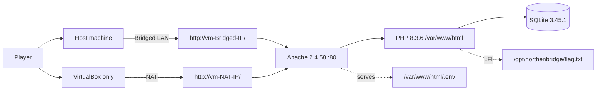

# Northenbridge-College-CTF — Instructor Walkthrough

> **INSTRUCTOR ONLY — CONTAINS SOLUTIONS.**
> Do not hand this file to students. The student-facing companion is
> `Scenarios/Student-Guide.md`.

> Flag values and the working credential are deliberately trunked and must be read from the running lab only. The final `NCC{...}` token is random per deployment and is referenced by **path only**.

| Field | Value |
|---|---|
| Lab name | Northenbridge College Portal CTF |
| Version | v2.0 documentation set |
| Audience | Instructor / reviewer only |
| Nominal duration | 120 minutes of work + 15 minute break = **135 minutes wall clock** |
| Difficulty | Beginner (no prior CTF experience assumed) |
| Prerequisites | Phase 3 lab complete; Vagrant + VirtualBox installed on the host; clean clone of the repository; Internet access on first `vagrant up` |
| Environment | Single Vagrant VM (`ubuntu/jammy64`), Apache 2.4.58, PHP 8.3.6, SQLite 3.45.1, VirtualBox 7.2.4 |

---

## 1. Lab summary

The Northenbridge College Portal is a fictional college web
application. Students register, receive generated credentials, log in,
and view their profile and examination marks. A separate, unlinked
administration portal lets staff search student records and edit marks.
The lab is seeded with fictional data only and is intentionally
vulnerable in six connected places: an unlinked admin route, a
web‑accessible `.env` decoy, an over‑confident UI‑level record
restriction, an unsafe search field that opens the entire database,
and a follow‑on file‑read parameter that reaches outside the database
into the server's filesystem.

---

## 2. Architecture at a glance

Single Vagrant VM. One Apache instance serves both the student and
admin portals from `/var/www/html`. SQLite stores application data.
The final `Flag 04` lives on the VM filesystem, outside the web root and
outside the database.



## 3. Service and route map
Linked = reachable from the normal site navigation.

Route | Auth required | Linked from nav? | Notes
-|-|-|-
/index.php | none |	yes | Public homepage Contains 
/about.php, /academics.php, /admissions.php, /contact.php, /events.php | none | yes | Static pages
/register.php | none | yes | Creates student, generates NC-* ID + password + initial marks
/login.php | none | yes | Student login
/profile.php | student | yes | Editable profile
/marks.php | student | yes | Read‑only marks (low Python by design)
/logout.php | student | yes | -	
/.env | none | no | Served text/plain, HTTP 200; 12 fictional credential pairs, one valid
/admin/ | none to view login |no | Unlinked; discovered by enumeration
/admin/index.php | none to view | no |Admin login, `Flag 01`: `NCC{Dis.....}` displayed here, <!-- backup: /.env --> hint in template
/admin/dashboard.php | admin | no | `Flag 02`: `NCC{Log......}` displayed here
/admin/edit-marks.php | admin | no | Restricted default view + SQLi (search=) + LFI (id=), `Flag 03`: `NCC{Exp.....}`
/admin/logout.php | admin| no | -
</br>  

Apache behavior: custom ErrorDocument for 404.html/500.html,
directory listing disabled, direct *.db blocked, PORTAL_DIR/includes
denied, .htaccess maps /profile and /marks to their .php pages
and routes unknown paths to the branded 404.

 ---

## 4. Stage-by-stage solution walkthrough
Each stage lists the goal, what the student should observe, the intended path, flag
location, common wrong turns, and the time budget.

> <h3>Stage 1 — Discover the hidden admin portal</h3>

**Goal:** Find the unlinked /admin/ route.
**What the student should observe:** The site never links to /admin.

**Intended path:** 
- Player registers a student account and logs in.
- Player browses the site, checks the page source, sees no hint in public HTML (the hint only exists inside admin/index.php).
- Player runs a directory enumeration against the VM target using any wordlists containing admin.
- /admin/ returns a login page rather than the branded 404.

**Flag 01:** `NCC{Dis.....}` is displayed on the admin login page (`/admin/index.php`) before any login. Evidence = the flag
string submitted to the submission platform.

**Common wrong turns**
- Scanning outside the lab. Stop this immediately — the rules forbid it.
- Expecting a hint in the public source. The `<!-- backup: /.env -->`
- comment lives only in the admin template.
- Missing the trailing slash (`/admin` vs `/admin/`). Both should work, if one 404s, try the other.

**Time budget for this stage:** 10–15 min.

> <h3>Stage 2 — Password spraying against the .env decoy</h3>

**Goal:** Use the decoy .env to identify the one working admin credential and log in.  
**What the student should observe:** `/.env` is served as text/plain with HTTP 200. It contains 12 fictional username:password pairs. Every wrong pair returns the same generic message ("Invalid administrator username or password"). No rate limit, no lockout, no CAPTCHA — by design, to make the spray obvious.  

**Intended path:** 
- Player visits `/.env` in the browser and copies the pairs.
- Player returns to `/admin/index.php` and tries each pair.
- Exactly one pair succeeds and lands the player on `/admin/dashboard.php`.
- The valid pair is username starting with `hel...` (this is a fictional, lab-only credential written by `infra/provision.sh` on every provision — it never appears in Git and never appears in the student guide).

Verification that the intended pair worked. Tail the access log:
```bash
vagrant ssh -c "sudo tail -f /var/log/apache2/northenbridge_access.log"
```

A successful POST to `/admin/index.php` followed by a GET to `/admin/dashboard.php` is the pivot. Everything before it is one failed POST per attempt.


**Common wrong turns:**
- Giving up after two or three pairs. The stage is about the spray.
- Assuming `/.env` should be blocked. It is intentionally served.
- Trying the student account on the admin form. It will not work.
- Confusing the "exposed credentials" stage with the SQLi stage — nothing in `.env` is a database payload.

**Time budget for this stage:** 15 min.

> <h3>Stage 3 — Access the admin dashboard</h3>

**Goal:** Confirm the boundary has been crossed and read the next flag.
**What the student should observe:** Look around admin dashboard and observer that dashboard displays limited student records and has marks-edit button. Also find second flag on same page.

**Intended path:** 
- After successful login the player is redirected here. They should read the flag, then follow the link to `/admin/edit-marks.php`.

**Flag 02:** `NCC{Log.....}` renders on the dashboard after a successful login. Evidence = the flag string + the access-log line showing the successful POST. This stage is mostly a mental checkpoint that the authentication boundary has actually been crossed.

**Common wrong turns:**
- Trying to skip straight to editing marks without reading the page.
- Treating the dashboard as the end of the lab.

**Time budget for this stage:** 5 min.

> <h3>Stage 4 — Restricted clerk view</h3>

**Goal:** Work out what the admin account is not allowed to see.
**What the student should observe:** The default (empty search) view of `/admin/edit-marks.php` shows only 5 NB-* records, all from the signed-in admin's own department. The player's own NC-* record is not present. There is no visible indication that anything is being filtered.

**Intended path:**
- Open `/admin/edit-marks.php` with no search term.
- Count the records. Note the ID prefix (NB-*) and the single department.
- Search for the player's own generated ID (NC-*) and observe that it returns nothing.    
- Notice the search field is the only input that changes the results.

**Common wrong turns:**
- Believing the NC-* record is missing because registration failed. Log out and log in as the student to confirm the record exists.
- Concluding the department restriction is a real security control. It is not — the only enforced scope is in the empty-search branch.

**Time budget for this stage:** 10 min.

> <h3>Stage 5 — Database exfiltration via the unsafe search</h3>

**Goal:** Use the SQL injection in search= to bypass the `NB-%` restriction, locate the player's own record. 

**What the student should observe:**
- The unsafe branch drops the department clause entirely and keeps a trailing AND s.student_id LIKE `NB-%` ORDER BY s.student_id on one line.
- A quote, a tautology, and a to‑end‑of‑line comment neutralize the trailing restriction.

**Intended path:**
- Close the quoted literal and the surrounding paren group with `')`.
- Add a tautology `OR '1'='1'`to make the `WHERE` clause always true.
- End with a `/*` so the `NB-%` tail and `ORDER BY` are commented out.
- Confirm the player's own `NC-*` record is now visible.

**Flag 03:** `NCC{Exp.....}` is displayed on this page when player clicks `edit marks` button for student with ID `NC-*`.Evidence = the flag string.

**Common wrong turns:**
- Wrong column count on the first `UNION`. Tell the student to count the visible columns on the page.
- Trying to `UNION` directly against students. `sqlite_master` first, always.
- Getting a blank page. The failure path is safe ("tudent not found"), so a blank page usually means the payload broke SQL syntax — check the quote and the comment marker.

**Time budget for this stage:** 30 min.

> <h3>Stage 6 — Final Flag 04 via LFI on (search=) & (id=)</h3>

**Goal:** Use the SQL injection in `search=` to dump the database — including the compliance note that points at the final flag and then Use the unvalidated `id=` parameter to read the file the compliance note pointed at, and retrieve the final `Flag 04`.

**What the student should observe:** `id=` has two behaviours, selected by whether the value begins with `/:` 
- Begins with / → treated as an absolute filesystem path and read with file_get_contents, no allowlist, no directory restriction.
- Does not begin with / → treated as student_id and looked up via a properly parameterized prepared statement (safe; not an SQLi vector).
- A UNION‑shaped payload with the correct column count (8: student_id, first_name, last_name, department, math, cpp, python, graphics) returns rows from other tables.
- sqlite_master enumerates the schema: `students`, `courses`, `marks`, `faculty`, `compliance_notes`,`admins`, `flags`.
- `compliance_notes` contains the bridging hint: "Full audit log archived at `/opt/northenbridge/flag.txt.`"


**Flag:** No dedicated flag value here — the deliverable is the clue string in `compliance_notes` that bridges to stage 6. 

**Intended path:**
- Close the quoted literal and the surrounding paren group with `')`.
- Add the tautology with a `UNION SELECT` on `sqlite_master` to enumerate tables — 8 columns, matching the output columns.
- Repeat the pattern against `compliance_notes`.
- Read the hint pointing at `/opt/northenbridge/flag.txt`.
- Player supplies the path from the compliance note: `?id=/opt/northenbridge/flag.txt`.
- The file is fetched and its contents displayed, revealing the final `Flag 04`.

**Flag 04:** NCC{...} — created by infra/provision.sh, stored root:www-data mode 0640. The token is random per deployment and is never in the database and never in Git. - - Evidence = the NCC{...} string plus the raw result set from the SQLi dump that revealed the path.

**Common wrong turns:**
- Treating the LFI as a SQL problem. The `search=` parameter is only SQL when the value does not start with `/`.
- Trying relative paths. Only absolute paths (leading /) trigger the file‑read branch.
- Trying to read files that the www-data process cannot read.
- Permission denied is expected — that is the point of the mode.

**Time budget for this stage:** 15 min.

## 5. Timing plan
Wall clock | Activity
-|-
0:00–0:10 | Intro, safety briefing, environment check
0:10–0:25 | Stage 1 — Discovery
0:25–0:40 | Stage 2 — Password spray
0:40–0:45 | Stage 3 — Dashboard
0:45–0:55 | Stage 4 — Restricted clerk view
0:55–1:10 | Break
1:10–1:40 |Stage 5 — SQLi and database dump
1:40–1:55 |Stage 6 — LFI and final flag
1:55–2:05 |Submission + written reflection
2:05–2:15 |Buffer / debrief


## 6. Flag register
No random NCC{...} value is written. Paths only.

Stage |	Flag | Location | Prerequisite
-|-|-|-
1 | `NCC{Dis.....}` | /admin/index.php (admin login page, unauthenticated) | Reach /admin/
2 | — (evidence is the successful login) | /var/log/apache2/northenbridge_access.log | One valid pair from .env
3 |`NCC{Log.....}` | /admin/dashboard.php | Admin session
4 | `NCC{Exp.....}` | /admin/edit-marks.php restricted view | Admin session
5 | — (clue string only) | compliance_notes row in SQLite | Successful SQLi
6 |`NCC{...}` | /opt/northenbridge/flag.txt | Path revealed by stage 5 clue; LFI on ?id=
</br>  

## 7. Reset procedure

Between students or between cohorts:
``` bash
vagrant destroy -f
vagrant up
```
Confirm the reset:
```bash
#For Bridged setup
curl -s -o /dev/null -w '%{http_code}\n' http://vm-Bridged-IP/`
# expect 200

#For NAT Setup
curl -s -o /dev/null -w '%{http_code}\n' http://vm-NAT-IP/`


vagrant ssh -c "ls -l /opt/northenbridge/flag.txt"
# expect: -rw-r----- 1 root www-data ... /opt/northenbridge/flag.txt

vagrant ssh -c "sudo -u www-data sqlite3 /var/lib/northenbridge/college.db \
    'SELECT COUNT(*) FROM students;'"
# expect a small non-zero seeded count
``` 
> vagrant provision on a live VM does not reset the database — seeding is idempotent. Use destroy + up for a true reset.

## 8. Troubleshooting
Symptom|Cause|Fix
-|-|-
Site not reachable after `vagrant up`| First boot slow, or provision failed | `vagrant status`; if running, wait, then vagrant up again. Check `vagrant ssh -c "sudo systemctl status apache2"`.
`/.env` returns 403 instead of 200 | FilesMatch/ForceType block missing after a manual edit, or Apache not reloaded | `vagrant reload --provision`; confirm /var/www/html/.env exists.
Directory enumeration finds nothing | Wordlist has no admin entry | Use a list that contains admin; confirm `/admin/` returns the login page directly.
Every `.env` pair fails on the admin form | `admins` row has drifted from the `.env` list | `vagrant reload --provision` — the provisioner re‑syncs the valid row.
Seeded rows missing after `up` | Database directory not writable by `www-data`, so the seed import silently failed | `vagrant ssh -c "sudo chown -R www-data:www-data /var/lib/northenbridge"` then re‑provision.
First `vagrant up` reports SSH boot timeout but the VM keeps running | Slow disk; the box needs more than 10 minutes to answer SSH |`vagrant up` again — Vagrant continues from where it stopped and runs the provisioner.
Final flag missing after re‑provision | Flag file only written if missing; if you deleted it by hand, re‑provision does not recreate it | `vagrant destroy -f && vagrant up`.
</br>

## 9.Safety briefing script
>This is an isolated training lab running on a local virtual
machine. Everything on it is fictional — the students, the marks,
the staff, and the credentials. You are authorised to test only
this VM. Do not scan, probe, or attack anything outside it. Do
not use any real credential anywhere. When you are done, submit
your flags and write your reflection. If you get stuck, ask —
guessing wildly is not the point. The lab will be reset between
sessions.

## 10. Known limitations
1. The SQLite database is shared by all players on one VM. Two players
editing marks at the same time will see each other's changes.
Reset between cohorts, or run one VM per small group.

2. The final `NCC{...}` flag is regenerated per provision. If you
re‑provision mid‑session, a previously captured value no longer
matches.

3. No rate limiting on the admin login. This is deliberate and is
documented in the student guide as a lab‑only design choice.

4. The five‑row default view is small by design. If a previous session
inserted extra `NB-*` rows, the count may exceed five — reset
between cohorts.

5. `northenbridge.local` is not resolvable from player devices by
default. Use the `VM's IP`, or configure local DNS.
